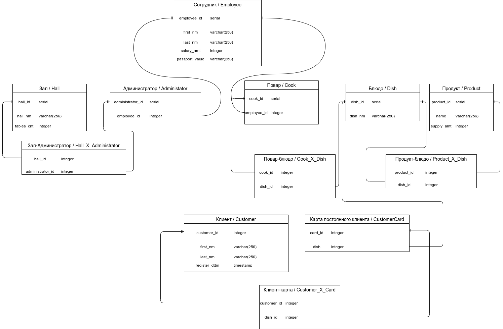

# Курсовая работа по базам данных Шелхонов Булат Б05-924

#### Концептуальная модель

#### Логическая модель

Я выбрал 3НФ, потому что по моему мнению она оптимальна в плане расходов памяти и по количество таблиц.

#### Физическая модель

